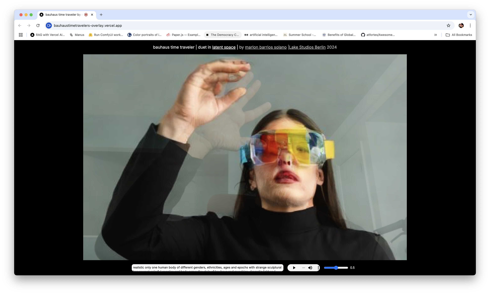

# Bauhaus Time Traveler | Duet in Latent Space

<div style="display: flex; gap: 20px; margin-bottom: 20px;">
  
</div>

## About the Project

**Bauhaus Time Traveler | Duet in Latent Space** is an interactive web application that creates real-time AI-generated imagery from webcam input, guided by text prompts and accompanied by a custom soundtrack. Developed by Marlon Barrios Solano during an art and research residency at Lake Studios Berlin (February 2024).

This project is part of the larger [Duets in Latent Space](https://github.com/marlonbarrios/duets-in-latent-space) series, exploring real-time collaborations between performers and AI.


<div style="display: flex; gap: 20px; margin-bottom: 20px;">
 
</div>

## Live Demo

The project is currently live at: [https://bauhaustimetravelers-overlay.vercel.app/](https://bauhaustimetravelers-overlay.vercel.app/)

### Features
- Real-time webcam to AI image generation
- Text-prompt guided transformations
- Custom audio accompaniment
- Adjustable AI influence strength
- Blend mode visual effects

## Demo Video

[](https://www.youtube.com/watch?v=jUfdvWQZAqE)

Watch a demonstration of the real-time interaction between performer and AI.

## Artistic Vision

The notion of Bauhaus artists as time travelers captures my imagination, painting them as navigators through speculative futures, escaping persecution, and finding solace in the purity of abstraction and geometry. These "Bauhaus Time Travelers" move with speed and beauty, their journey a harmonious blend of geometries and fluidity, experimentation, and design, transcending their era's constraints and embodying diverse identities.

## Technical Setup

### Prerequisites
- Node.js
- Fal.ai API key

### Installation

1. **Clone and Install**
```bash
git clone https://github.com/marlonbarrios/bauhaus-time-traveler.git
cd bauhaus-time-traveler
npm install
```

2. **Configure Environment**
Rename `.env.local.example` to `.env.local` and add your Fal.ai API Key:
```
FAL_AI_API_KEY=your_api_key_here
```

3. **Run the Application**
```bash
npm run dev
```
Open `http://localhost:3000` in your browser.

## License and Attribution

### MIT License
Copyright (c) 2024 Marlon Barrios Solano

Permission is hereby granted, free of charge, to any person obtaining a copy
of this software and associated documentation files (the "Software"), to deal
in the Software without restriction, including without limitation the rights
to use, copy, modify, merge, publish, distribute, sublicense, and/or sell
copies of the Software, and to permit persons to whom the Software is
furnished to do so, subject to the following conditions:

The above copyright notice and this permission notice shall be included in all
copies or substantial portions of the Software.

THE SOFTWARE IS PROVIDED "AS IS", WITHOUT WARRANTY OF ANY KIND, EXPRESS OR
IMPLIED, INCLUDING BUT NOT LIMITED TO THE WARRANTIES OF MERCHANTABILITY,
FITNESS FOR A PARTICULAR PURPOSE AND NONINFRINGEMENT. IN NO EVENT SHALL THE
AUTHORS OR COPYRIGHT HOLDERS BE LIABLE FOR ANY CLAIM, DAMAGES OR OTHER
LIABILITY, WHETHER IN AN ACTION OF CONTRACT, TORT OR OTHERWISE, ARISING FROM,
OUT OF OR IN CONNECTION WITH THE SOFTWARE OR THE USE OR OTHER DEALINGS IN THE
SOFTWARE.

### Credits
Created by [Marlon Barrios Solano](https://marlonbarrios.github.io/)
- Portfolio: [marlonbarrios.github.io](https://marlonbarrios.github.io/)
- Linktree: [linktr.ee/marlonbarriososolano](https://linktr.ee/marlonbarriososolano)


